# 🚀 Scaling Transformers

> Scaling Transformers refers to increasing the capability of Transformer-based models by scaling **parameters, data, compute, architecture, reasoning, and system-level intelligence**.

Modern Large Language Models (LLMs) such as GPT, Llama, Claude, and Gemini have achieved breakthrough capabilities through systematic scaling.

---

## 🧠 Transformer Scaling Overview

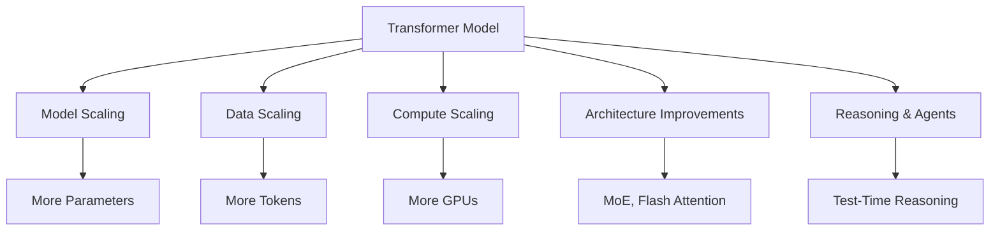

---

# 1. 📈 The Three Dimensions of Scaling

## 🔹 1. Model Scaling (Parameters)

Increasing the number of learnable parameters improves:

✅ Language understanding  
✅ Reasoning capability  
✅ Few-shot learning  
✅ Code generation  
✅ Generalisation  

| Model | Parameters | Year |
|---|---:|---:|
| GPT-2 | 1.5B | 2019 |
| GPT-3 | 175B | 2020 |
| Llama 2 | 7B - 70B | 2023 |
| Llama 3 | 8B - 405B | 2024 |
| GPT-5 class models | Not disclosed | 2025+ |

> Larger models are not automatically better. They require sufficient training data and compute.

---

# 2. 📚 Data Scaling

Transformer intelligence depends heavily on training data quality.

## Modern LLM datasets include:

- 📖 Books
- 🌐 Web documents
- 💻 Source code
- 🔬 Scientific papers
- 💬 Conversations
- 🤖 Synthetic training data

### Data Quality Pipeline

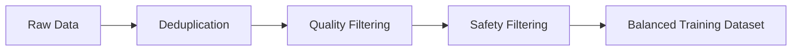

---

# 3. ⚡ Compute Scaling

Large Transformer models require distributed AI infrastructure.

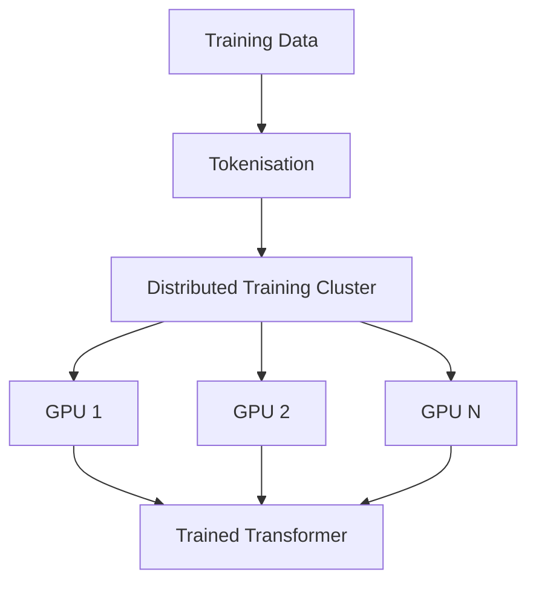

Modern training infrastructure:

| Technology | Purpose |
|---|---|
| H100/H200 GPUs | Large-scale acceleration |
| TPU clusters | AI specialised compute |
| Data Parallelism | Scale training batches |
| Tensor Parallelism | Split model weights |
| Pipeline Parallelism | Split model layers |
| BF16/FP16 | Faster training |

---

# 4. 📐 Transformer Scaling Laws

Transformer performance follows predictable scaling behaviour.

\[
Loss = f(Parameters, Data, Compute)
\]

Simplified:

\[
L(N,D,C)=A N^{-\alpha}+B D^{-\beta}+C
\]

Where:

| Symbol | Meaning |
|---|---|
| N | Model parameters |
| D | Training tokens |
| C | Compute budget |
| L | Training loss |

---

# 5. 🧪 Chinchilla Scaling

A key discovery:

> Many large models were too large and under-trained.

Optimal scaling requires balancing:

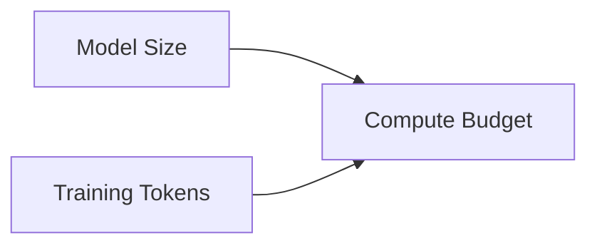

Example:

| Approach | Parameters | Tokens |
|-|-:|-:|
| Large but under-trained | 175B | 300B |
| Better balanced | 70B | 1.4T |

A smaller model trained on more data can outperform a larger model.

---

# 6. 🏗️ Architectural Scaling Improvements

## 🔥 Mixture of Experts (MoE)

Instead of activating the entire model:

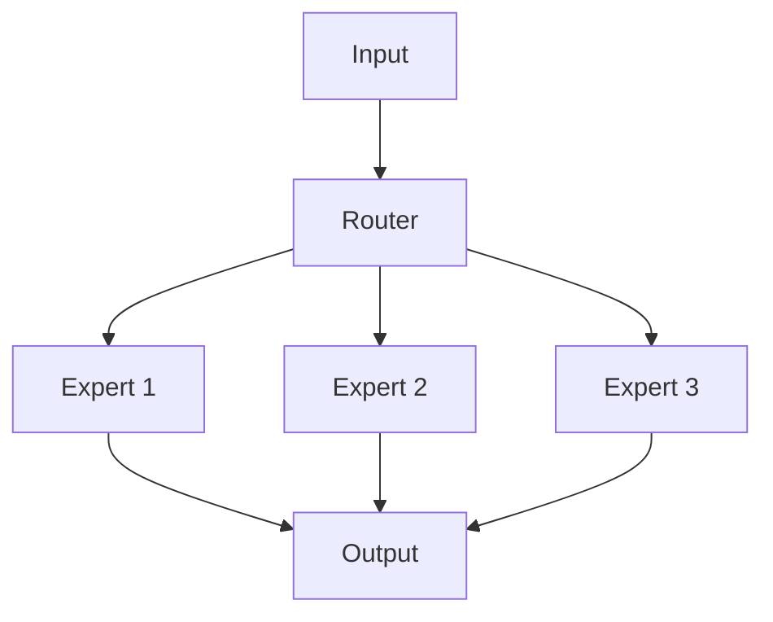

Benefits:

✅ More total parameters  
✅ Lower inference cost  
✅ Specialised knowledge  

Examples:

- Mixtral
- Switch Transformer

---

# 7. 🪟 Context Window Scaling

Evolution:

| Generation | Context |
|-|-:|
| Early Transformers | 512 tokens |
| GPT-3 era | ~2K-4K tokens |
| Modern LLMs | 128K+ tokens |

Techniques:

- Rotary Position Embeddings (RoPE)
- ALiBi
- Sliding Window Attention
- Flash Attention

---

# 8. ⚡ Attention Optimisation

Standard attention:

\[
Attention(Q,K,V)=softmax(\frac{QK^T}{\sqrt d})V
\]


Complexity:

\[
O(n^2)
\]


Challenges:

- Longer documents become expensive
- Memory usage increases rapidly

Solutions:

| Technique | Benefit |
|---|---|
| Flash Attention | Faster GPU memory operations |
| Sparse Attention | Focus on relevant tokens |
| KV Cache | Faster inference |

---

# 9. 🌐 Distributed Training Strategies

## Data Parallelism

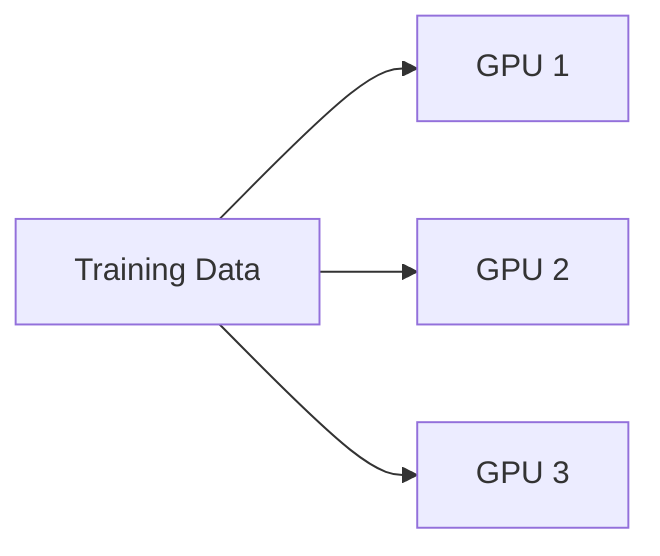

---

## Tensor Parallelism

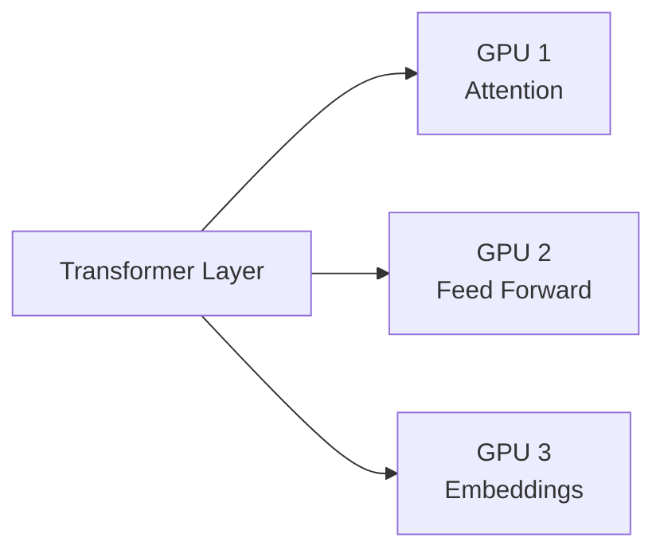

---

## Pipeline Parallelism

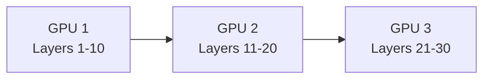

---

# 10. 🧩 Scaling Beyond Model Size

The future is not only bigger models.

## Test-Time Scaling

More reasoning compute during inference:

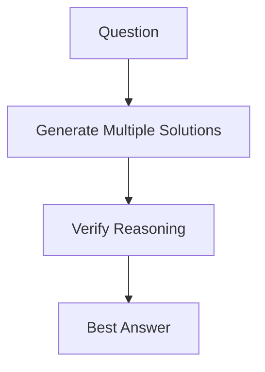

---

## Retrieval-Augmented Generation (RAG)

External knowledge instead of storing everything inside parameters.

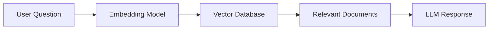

Benefits:

✅ Current information  
✅ Lower hallucination  
✅ Domain adaptation  

---

# 11. 🤖 Agentic Scaling

The next evolution:

### Traditional LLM

```
Prompt
  |
  v
Response
```

### Agentic AI

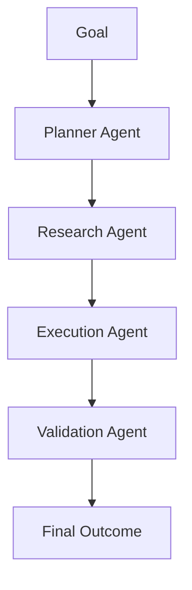

The scaling unit becomes:

> **Models + Tools + Memory + Reasoning + Autonomous Workflows**

---

# 12. ⚠️ Challenges

| Challenge | Solution |
|---|---|
| GPU cost | MoE, quantisation |
| Memory limits | Flash Attention, ZeRO |
| Slow inference | KV cache, speculative decoding |
| Hallucinations | RAG, verification |
| Data quality | Filtering, synthetic data |
| Alignment | RLHF, DPO |
| Energy usage | Efficient architectures |

---

# 🔮 Future of Transformer Scaling

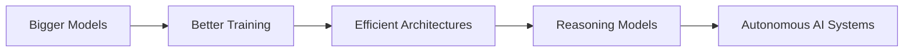

## The New Scaling Equation

```
Future AI Capability =
Parameters
+ Data
+ Compute
+ Reasoning
+ Tools
+ Agents
```

---

## Key Takeaway

> The future of AI will not be achieved only by building larger Transformers.  
> It will come from combining powerful models with reasoning, retrieval, tools, and autonomous systems.
