# 🧠 Transformers: Reasoning & Agents

> **The evolution of AI is moving from predicting text to solving problems.**  
> Modern Transformer systems combine **reasoning, tools, memory, retrieval, and autonomous actions** to create intelligent systems capable of completing complex tasks.

---

## 🌎 The Evolution of Transformer Intelligence

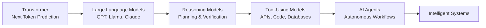

---

# 1. 🔍 What is Transformer Reasoning?

Traditional Transformers learn:

\[
P(token_{n+1}|token_1,...,token_n)
\]

They predict the most likely next token based on learned patterns.

However, real-world problems require:

| Capability | Example |
|---|---|
| 🧩 Multi-step reasoning | Solving complex problems |
| 🧮 Mathematical logic | Calculations and proofs |
| 🔎 Information synthesis | Combining multiple sources |
| 📅 Planning | Creating execution strategies |
| ✅ Verification | Checking correctness |

---

# 2. ⚖️ Standard LLM vs Reasoning Models

| Capability | Standard LLM | Reasoning Model |
|---|---|---|
| Text generation | ✅ Excellent | ✅ Excellent |
| Summarisation | ✅ | ✅ |
| Simple questions | ✅ | ✅ |
| Multi-step reasoning | ⚠️ Limited | ✅ Strong |
| Planning | ⚠️ Limited | ✅ Strong |
| Self-correction | ⚠️ Limited | ✅ Strong |
| Complex decision making | ⚠️ | ✅ |

---

# 3. 🧠 Chain-of-Thought Reasoning

Reasoning models improve performance by performing intermediate computation.

### Without Reasoning

```text
Question
   |
   v
Answer
```

---

### With Reasoning

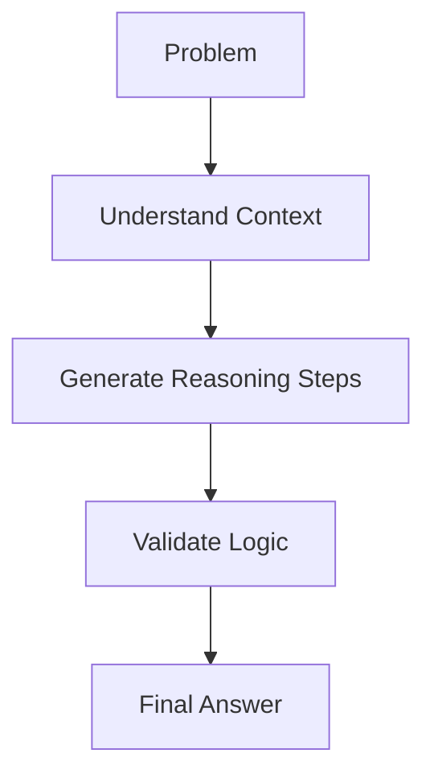

---

# 4. 🚀 Test-Time Scaling

Traditional AI scaling:

```text
More Parameters
        |
        v
Better Model
```

Modern AI scaling:

```text
More Reasoning Compute
        |
        v
Better Decisions
```

---

## Reasoning Search

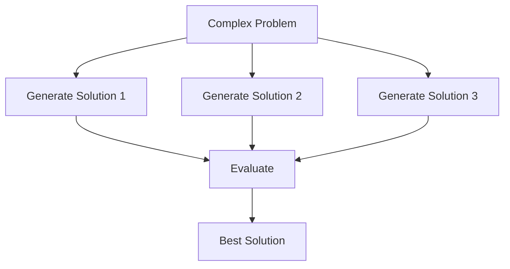

Benefits:

✅ Higher accuracy  
✅ Better reasoning  
✅ Reduced hallucination  
✅ Improved reliability  

---

# 5. 🧩 Advanced Reasoning Techniques

## 🔹 Chain-of-Thought (CoT)

Break problems into smaller steps.

```text
Problem
   |
   v
Intermediate Reasoning
   |
   v
Solution
```

---

## 🔹 Self-Consistency

Multiple reasoning paths are generated.

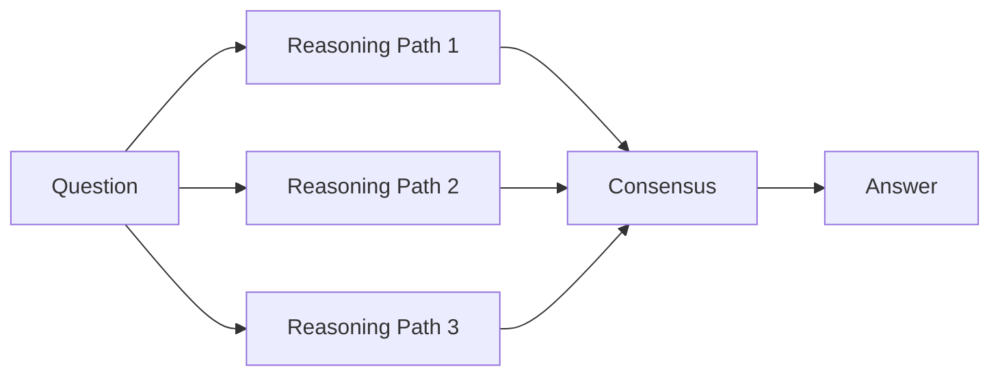

---

## 🔹 Tree-of-Thoughts

Explore multiple possible solutions.

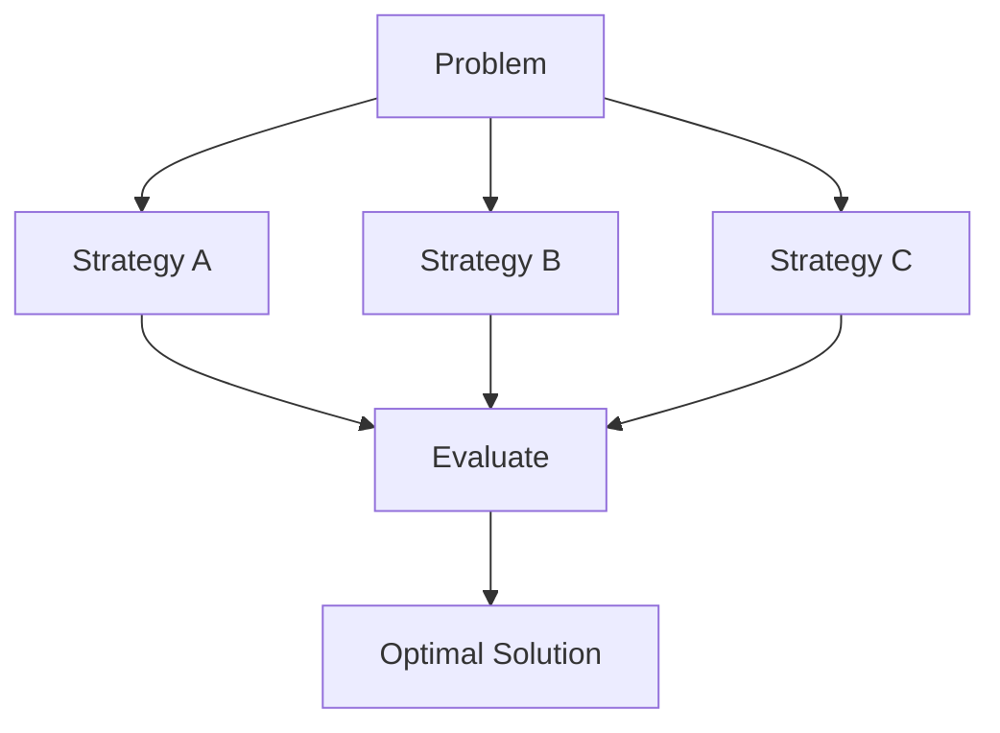

---

# 6. 🛠️ Tool-Augmented Reasoning

LLMs become more powerful when connected to external capabilities.

## Traditional LLM

```text
Question
   |
   v
LLM
   |
   v
Response
```

---

## Tool-Enabled AI

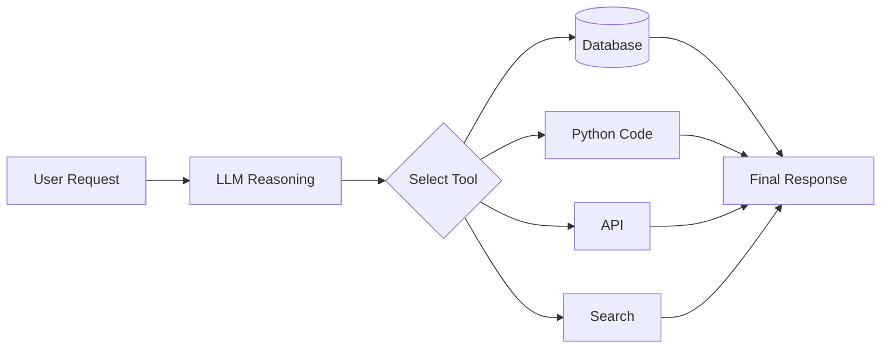

---

## Common Tools

| Tool | Purpose |
|---|---|
| 🗄️ SQL | Query enterprise data |
| 🐍 Python | Analysis & computation |
| 🔎 Search | External knowledge |
| 📚 RAG | Document retrieval |
| 🔌 APIs | System interaction |

---

# 7. 🤖 From LLMs to AI Agents

## Traditional LLM

```text
Prompt
  |
  v
Response
```

---

## Autonomous Agent

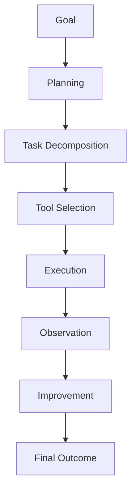

---

# 8. 🏗️ AI Agent Architecture

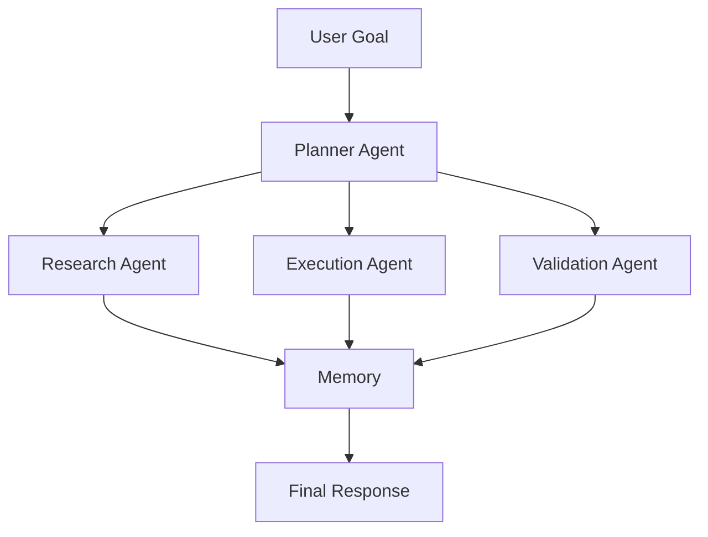

---

# 9. 🧠 Core Agent Components

## 1️⃣ Planning

Agents convert goals into executable tasks.

Example:

```
Goal:
Analyse customer churn

Plan:
1. Retrieve customer data
2. Analyse behaviour
3. Build prediction model
4. Generate recommendations
```

---

## 2️⃣ Memory

Agents maintain knowledge over time.

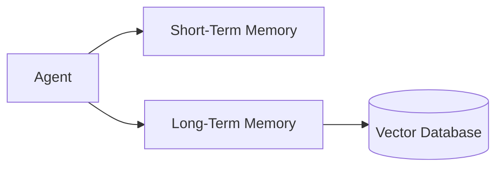

---

## 3️⃣ Tools

Agents interact with external systems.

| Capability | Example |
|---|---|
| Data access | SQL databases |
| Computation | Python |
| Knowledge | RAG |
| Automation | APIs |
| Workflow | Business systems |

---

## 4️⃣ Reflection & Validation

Agents evaluate their own work.

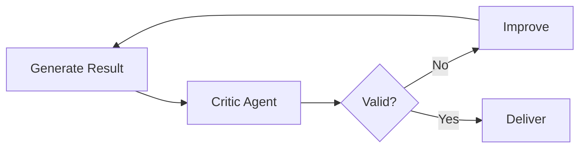

---

# 10. 👥 Multi-Agent Systems

Complex problems can be divided between specialised agents.

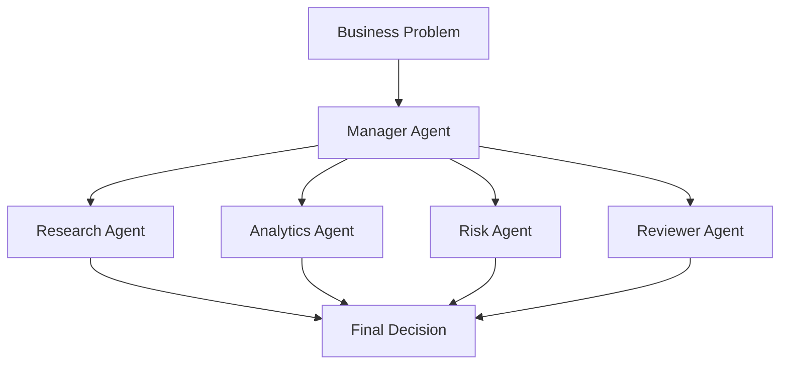

---

# 11. 🏦 Example: Enterprise AI Agent System

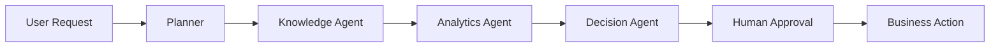

Applications:

- Financial crime investigation
- Customer service automation
- Software engineering assistants
- Supply chain optimisation
- Healthcare decision support

---

# 12. 📈 The New AI Scaling Equation

## Previous Scaling

```text
AI Capability

=
Parameters
+
Data
+
Compute
```

---

## Future Scaling

```text
AI Capability

=

Parameters
+
Data
+
Compute
+
Reasoning
+
Tools
+
Memory
+
Agents
+
Actions
```

---

# 🔮 The Future of Transformers

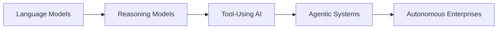

---

# ⭐ Key Takeaway

> Transformers began as systems that predict the next token.  
>
> The next generation of AI systems will reason, use tools, remember context, collaborate with other agents, and execute business workflows autonomously.

**The future of scaling of Transformers is not only bigger models — it is smarter systems.**

---
